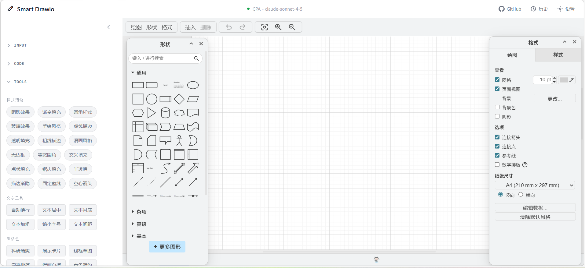

# Smart Drawio Next

> Generate editable, publication-ready Draw.io diagrams from natural language or reference images in seconds.

[中文文档](./README.md)

## Live Demo

Try it online: <https://smart-drawio-next.vercel.app/>

(Requires your own API Key)

## Screenshots




## Introduction

[Smart Drawio Next](https://github.com/yunshenwuchuxun/smart-drawio-next) combines Next.js 16, an embedded Draw.io canvas, and streaming LLM calls to let you:

- Describe a diagram in natural language or upload a reference image to generate structured charts automatically.
- Fine-tune the generated XML code in a built-in Monaco Editor.
- Sync results to the embedded Draw.io canvas for visual adjustments with one click.
- Use the advanced optimization panel to let AI clean up layouts, unify styles, or add annotations.

The project ships with multi-model configuration, access passwords, generation history, notifications, and more — ready to deploy as a personal productivity tool or an internal team service.

## Features

- **LLM-Native Diagramming** — Streams generation progress in real time with "continue generation" support for long outputs. Choose from 20+ diagram types or let the model decide automatically.
- **Multimodal Input** — Drag-and-drop PNG/JPG/WebP/GIF (up to 5 MB) or use the file picker. Vision models convert existing diagrams into editable content.
- **Dual-Canvas Sync** — Monaco Editor for viewing and editing raw code, Draw.io iframe for rendering and visual tweaking. Re-apply code at any time.
- **Smart Optimization** — One-click arrow anchor and line-width fixes, or use the advanced optimization panel to let AI handle custom requirements.
- **Configuration Manager** — Create, clone, import/export any number of OpenAI/Anthropic-compatible configs from the UI with live connection testing.
- **History & Notifications** — Last 20 generations saved in browser localStorage with instant replay. Toast notifications and confirmation dialogs improve overall UX.

## Diagram Types

20+ diagram types available — pick one or let the model decide:

| Type | Type | Type | Type |
|------|------|------|------|
| Flowchart | Mind Map | Org Chart | Sequence Diagram |
| UML Class | ER Diagram | Gantt Chart | Timeline |
| Tree | Network Topology | Architecture | Data Flow |
| State Diagram | Swimlane | Concept Map | Fishbone |
| SWOT Analysis | Pyramid | Funnel | Venn Diagram |
| Matrix | Infographic | | |

## Diagram Themes

10 built-in color themes, one-click switch:

| Theme | Best For |
|-------|----------|
| Research | Paper figures, academic posters |
| Business | Business reports, project reviews |
| Warm | Education, user-facing demos |
| Cool | Technical architecture, system design |
| Dark | Dark-background presentations |
| Contrast | Projector presentations, visual emphasis |
| Pastel | Lightweight docs, friendly style |
| Forest | Nature, sustainability topics |
| Violet | Creative, design-oriented diagrams |
| Neutral | General docs, low visual noise |

## Tools System

Post-process diagrams via the sidebar "Tools" panel. All operations are XML transforms — instant, undoable.

### Drawing Tricks

Batch adjustments to diagram structure and connectors:

| Trick | Description |
|-------|-------------|
| Grid Snap | Align all coordinates to a 10px grid |
| Orthogonal Routing | Switch connectors to right-angle polylines with auto waypoints |
| Curved Routing | Switch connectors to smooth curves |
| Label Background | Add white background to connector labels |
| Consistent Spacing | Equalize horizontal spacing between same-layer elements |
| Jump Crossings | Show arc jumps at connector crossings |
| Rounded Edges | Round connector bends |
| Normalize Arrows | Unify to solid end arrows, remove start arrows |
| Remove Waypoints | Clear manual waypoints, let routing auto-calculate |

### Style Presets

Toggle visual effects, freely stackable:

| Preset | Description |
|--------|-------------|
| Shadow | Add drop shadow to shapes |
| Gradient | Auto-generate downward gradient from fill color |
| Rounded | Enable rounded corners |
| Glass | Add draw.io glass highlight |
| Sketch | Enable rough sketch hand-drawn effect |
| Comic | Cartoon-style with slight line jitter |
| Dashed | Switch to dashed borders/connectors |
| Transparent | Lower fill opacity for wireframe style |
| Bold Stroke | Thicken shapes and connectors to 3px |
| No Stroke | Remove borders, flat color blocks only |
| Absolute Arc | Uniform rounded corners using absolute pixel values |
| Cross-Hatch / Dots / Zigzag | Various hand-drawn pattern fills |
| Open Arrow | Use open triangle arrowheads |

### Style Packs

Apply a complete visual style in one click — covers shapes, connectors, and text:

| Pack | Description |
|------|-------------|
| Research Clean | No decorations, orthogonal lines, neat text — paper-ready |
| Presentation Cards | Rounded + shadow + curves — presentation-ready |
| Business Clean | Formal style with rounded shadows and orthogonal routing |
| Flat Minimal | Remove all decorations, modern flat design |
| Wireframe | Reduced visuals, focus on layout discussion |
| Comic Whiteboard | Casual whiteboard discussion style |
| Watercolor Sketch | Hachure fills + curves — artistic sketch feel |
| Minimal Outline | No fill, pure outlines, structure only |
| Sticky Notes | Large rounded corners + soft shadows, sticky-note feel |
| Blueprint Tech | Fixed dashes + low-opacity fills, engineering blueprint style |

### Text Tools

Batch text formatting adjustments:

| Tool | Description |
|------|-------------|
| Wrap Labels | Enable HTML and whiteSpace=wrap |
| Center Text | Unify horizontal/vertical centering |
| Text Panels | Add white background + light border to labels |
| Bold Text | Set all text to bold |
| Compact Text | Unify to 11px font size for dense diagrams |
| Text Padding | Increase spacing between text and shape borders |

## UI Modules

1. **Input Area (Chat + ImageUpload)**
   - Select a diagram type, enter a natural language prompt, or upload a reference image.
   - Supports mid-generation stop, continue generation, and API error display.
2. **Code Editor**
   - Monaco Editor displays generated XML with clear, optimize, advanced optimize, and apply actions.
   - Instant error feedback on XML parse failures.
3. **Canvas (DrawioCanvas)**
   - Embedded Draw.io iframe renders generated XML for further visual editing.
4. **Auxiliary Modals**
   - `ConfigManager`: Multi-config management, live testing, import/export.
   - `AccessPasswordModal`: Access password setup and verification.
   - `HistoryModal`, `ContactModal`, `OptimizationPanel`, etc.

## Tech Stack

| Layer | Technology |
|-------|-----------|
| Framework | Next.js 16 (App Router) + React 19 |
| Canvas | Draw.io embed (iframe) |
| Editor | @monaco-editor/react |
| Styling | Tailwind CSS v4 + custom design system |
| LLM Integration | OpenAI / Anthropic-compatible APIs with SSE streaming |
| State Persistence | localStorage (configs, history, access password) |

## Getting Started

### Prerequisites

- Node.js >= 18.18
- pnpm >= 8 (recommended)
- An OpenAI / Anthropic-compatible API Key (or server-side config with access password)

### Installation

```bash
git clone https://github.com/yunshenwuchuxun/smart-drawio-next.git
cd smart-drawio-next
pnpm install
pnpm dev
```

Open <http://localhost:3000> in your browser.

### Scripts

| Command | Description |
|---------|-------------|
| `pnpm dev` | Start development server |
| `pnpm build` | Production build |
| `pnpm start` | Start production server (run `pnpm build` first) |
| `pnpm lint` | Run ESLint |

## Docker Deployment

### Prerequisites

- Docker >= 20.10
- Docker Compose V2 (`docker compose`)

### Quick Start

```bash
docker compose up -d --build
```

Open <http://localhost:3000>. The image uses a multi-stage build (`node:22-alpine`) with Next.js standalone output for a small footprint and fast startup.

### Server-Side LLM Configuration (Optional)

To let users share a single API Key via access password, uncomment and fill in the environment variables in `docker-compose.yml`:

```yaml
services:
  app:
    environment:
      - ACCESS_PASSWORD=your-secure-password
      - SERVER_LLM_TYPE=openai
      - SERVER_LLM_BASE_URL=https://api.openai.com/v1
      - SERVER_LLM_API_KEY=sk-xxx
      - SERVER_LLM_MODEL=gpt-4
```

Alternatively, create a `.env` file (see `.env.example`).

### Network & Proxy Configuration

The default `docker-compose.yml` does not bind any proxy settings, making it safe to commit to Git. For environments that require extra network configuration:

1. Copy the override example:
   ```bash
   cp docker-compose.override.example.yml docker-compose.override.yml
   ```
2. Edit to match your environment, then restart:
   ```bash
   docker compose up -d --build
   ```

Docker Compose automatically merges `docker-compose.yml` with `docker-compose.override.yml`.

#### Common Scenarios

| Scenario | Configuration |
|----------|--------------|
| Route traffic through a host proxy | Enable `NODE_USE_ENV_PROXY=1`, `HTTP_PROXY`, `HTTPS_PROXY` |
| Access a host-local model (Ollama, LM Studio, etc.) | Set `ALLOW_LOCAL_LLM_BASE_URLS=true`, use `http://host.docker.internal:<port>` as the Base URL |
| Proxy re-signs HTTPS certificates | Mount your CA cert and set `NODE_EXTRA_CA_CERTS` (see example below). Avoid `NODE_TLS_REJECT_UNAUTHORIZED=0` |

**Custom CA certificate example** (in `docker-compose.override.yml`):

```yaml
services:
  app:
    environment:
      NODE_EXTRA_CA_CERTS: "/usr/local/share/ca-certificates/proxy-ca.crt"
    volumes:
      - ./certs/proxy-ca.crt:/usr/local/share/ca-certificates/proxy-ca.crt:ro
```

### Useful Commands

```bash
docker compose logs -f app      # View logs
docker compose down              # Stop services
docker compose up -d --build     # Rebuild after code changes
docker compose ps                # Check running status
```

## LLM Configuration & Access Password

### Client-Side Multi-Config (Default)

1. Click **"Settings"** in the top-right corner.
2. Choose a provider (OpenAI / Anthropic / compatible).
3. Fill in `Base URL`, `API Key`, `Model`, and click "Test Connection" to verify.
4. Configs are stored exclusively in browser localStorage. Switch, clone, export, or import as needed.

### Server-Side Unified Config (Access Password Mode, Optional)

To share a single API Key across users:

1. Copy the example config: `cp .env.example .env`
2. Set the following variables in `.env`:

| Variable | Description |
|----------|-------------|
| `ACCESS_PASSWORD` | Password users must enter |
| `SERVER_LLM_TYPE` | `openai` or `anthropic` |
| `SERVER_LLM_BASE_URL` | API endpoint (e.g., `https://api.openai.com/v1`) |
| `SERVER_LLM_API_KEY` | API key (server-side only, never sent to the browser) |
| `SERVER_LLM_MODEL` | Default model name |

3. Restart the service. Users enter the access password in the UI to activate server-side config, which takes priority over local settings.

> The access password is verified server-side only. The real API Key is never exposed to the browser.

## FAQ

- **Is my API Key uploaded anywhere?**
  No. Local configs are stored in browser localStorage. The key is only sent to your own server during `/api/generate` calls, which then forwards requests to the LLM provider.

- **What if generation is truncated?**
  A "Continue Generation" button appears automatically. Clicking it sends a follow-up request with `isContinuation=true` to resume from where it left off.

- **Image recognition not working?**
  Use a Vision-capable model (e.g., GPT-4o, GPT-4.1, Claude 3.5 Sonnet) and ensure the image is under 5 MB in a common format.

- **Does history take up space?**
  History is capped at 20 entries. You can delete individual entries or clear all from the History modal.

- **Access password shows "not configured"?**
  Both `ACCESS_PASSWORD` and all `SERVER_LLM_*` variables must be set. Otherwise the API returns "Server access password not configured".

## Contributing

1. This project is based on [smart-excalidraw-next](https://github.com/liujuntao123/smart-excalidraw-next).
2. If you find this project helpful, please consider:
   - Giving it a star on GitHub
   - Sharing it with others who might benefit

## License

MIT License — free to use, copy, and distribute with attribution.
